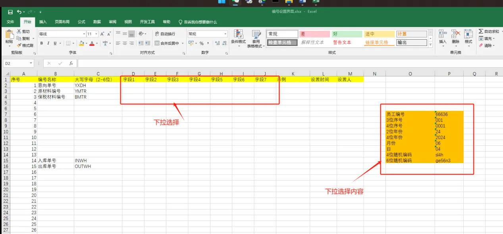

## 编号设置

接口设置：		
`/number/fied/list `：返回编号的字段

需求：

流程：
>需要实现哪些接口？
    仿照仓库设置
  
    1. field/list 显示所有字段
      2.

1. 接口跳转到控制层 
    在controller新建c_num.go 编写控制层
    1. 从前端获取哪些信息？
    common-request中进行记录
    number.go定义结构体
    - 更新编号规则 从请求体中获得form-data表单数据
        numberField结构体除了deleted_at等自动生成的字段

 

2. 模型层
   在服务层 查询 或者进行 校验
    number对应的表结构 numberfield
    |ID（主键）|编号名称（什么单号）|首字符|字段1|字段2|字段3|字段4|字段5|字段6|字段7|示例|设置人|CreatedAt|UpdateAt|DeletedAt|
    |---|---|---|---|---|---|---|---|---|---|---|---|---|---|---|
    |1|意向单号|YXDH||||||||||

    可供选择字段：
    1. 员工编号
    2. 3位序号
    3. 4位序号
    4. 2位年份
    5. 月份
    6. 日
    7. 4位随机编码
    8. 6位随机编码

3. 需要返回哪些信息？
    - 编号名称 -> 获取其大写字母
        eg 意向单号 YXDH
    - 字段1-7
    - 示例
    - 设置时间
    - 设置人